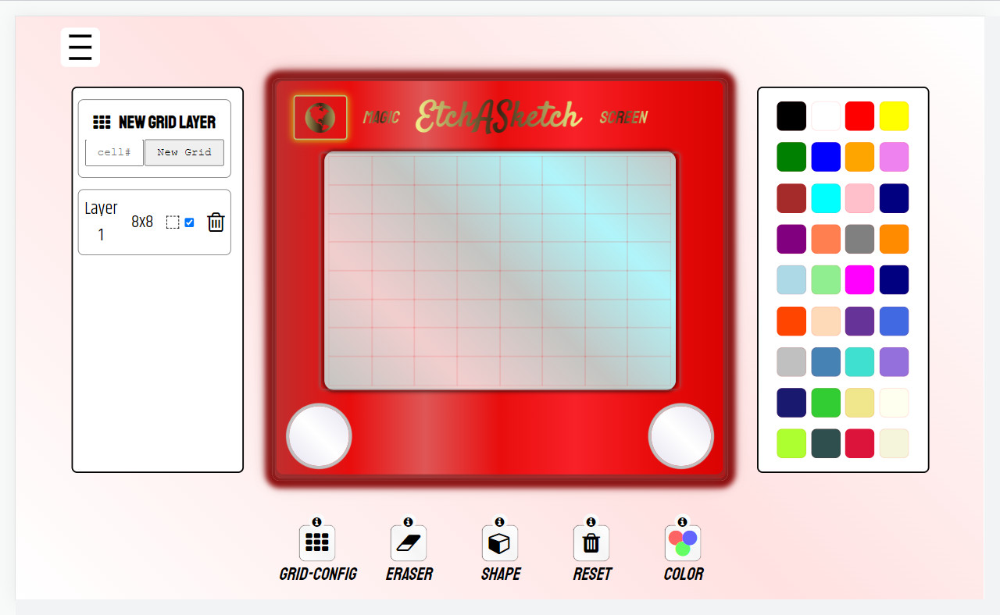

#  Etch A Sketch | <a href="https://mattxmade.github.io/odin-etch-a-sketch" target="_blank"> <strong>Live</strong></a>

> ### A HTML CSS JavaScript project based on the classic toy

 

  
   

##

### About
A drawable area is the main feature of this work. 

Using JavaScript, I wrote a program to generate a user defined number of cells to form a grid. This grid can then be drawn upon. The program uses an array to store newly created cells and math is used to access the cell size based on the overall size of the grid. 

Event listeners are used throughout to track mouse moevements when over the grid draw area. I also pushed myself to create a closer interaction between CSS + JavaScript to create fluid animations.

##

### Features
<ul>
  <li>Option to change number of cells</li>
  <li>Eraser</li>
  <li>Colour changer</li>
  <li>Ability to change cell shape</li>
  <li>Grid layer configurator</li>
</ul>

##

### Deployment

(<a href="#readme-top">back to top</a>)

